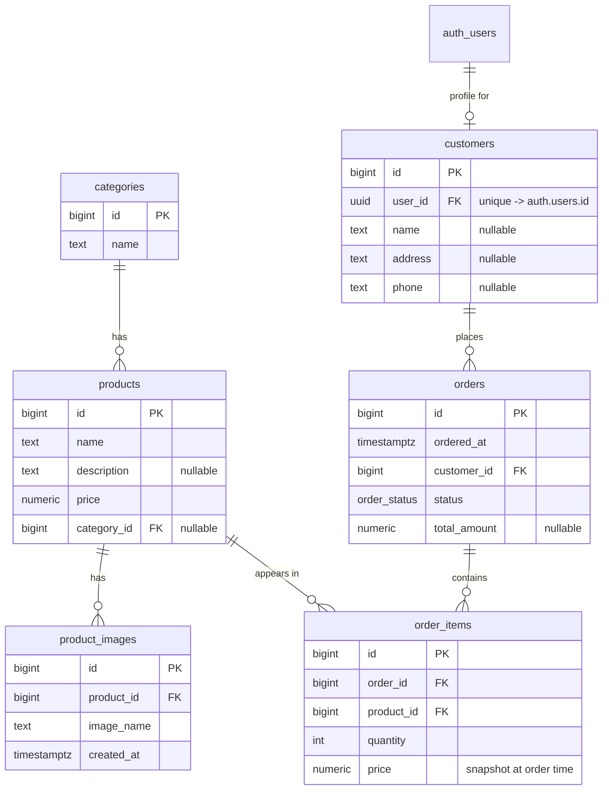

# Database Spec — E-commerce (Supabase / Postgres)

Source of truth for the data model drawn in [`ER-Diagram-ecommerce.png`](./ER-Diagram-ecommerce.png).

**Status:** proposal. The linked Supabase project's `public` schema is currently empty — nothing in this document has been applied. All SQL here is illustrative; migrations are a separate task.

**Scope:** exactly the six tables in the diagram plus the `order_status` enum. Cart, reviews, payments, shipping addresses and stock/inventory are deliberately out of scope.

---

## 1. Overview

Six tables in `public`, plus one enum type. Identity comes from Supabase Auth: `customers.user_id` is the only link to `auth.users`, and every ownership rule in the RLS section resolves through it.



---

## 2. Conventions

| Rule | Why | Reference |
|---|---|---|
| Lowercase `snake_case` identifiers, no quoting | Unquoted identifiers fold to lowercase; mixed case forces quoting everywhere | `schema-lowercase-identifiers.md` |
| PKs are `bigint generated always as identity` | SQL-standard, sequential, 8 bytes, no `int4` overflow ceiling | `schema-primary-keys.md` |
| `text` instead of `varchar(n)` unless a real limit exists | Same performance, no arbitrary cap | `schema-data-types.md` |
| `timestamptz`, never `timestamp` | Timezone-aware; Supabase clients send UTC offsets | `schema-data-types.md` |
| `numeric(10,2)` for money, never `float` | Exact decimal arithmetic | `schema-data-types.md` |
| Every foreign key column gets an index | Postgres does not index FKs automatically; joins and cascades otherwise seq-scan | `schema-foreign-key-indexes.md` |
| RLS enabled on every table in `public` | Anything reachable by the anon/authenticated keys is exposed without it | `security-rls-basics.md` |
| `auth.*` calls wrapped in `(select …)` inside policies | Evaluated once per query instead of once per row | `security-rls-performance.md` |

References live in `.claude/skills/supabase-postgres-best-practices/references/`.

---

## 3. Deviations from the diagram

The set of tables, columns, relationships and nullability matches the PNG exactly. Only physical types are modernized:

| Diagram | This spec | Reason |
|---|---|---|
| `int4` PK / FK columns | `bigint generated always as identity` (PKs), `bigint` (FKs) | `int4` overflows at ~2.1B rows; `identity` is the SQL-standard replacement for `serial` |
| `varchar` (`products.name`, `categories.name`, `customers.name/address/phone`) | `text` | No arbitrary length cap, identical performance |
| `order_status` — values not shown in the diagram | `pending, paid, shipped, delivered, cancelled` | **Assumption.** See [§9 Open questions](#9-open-questions) |

Two additions that are constraints rather than new columns:

- `customers.user_id` gets a `unique` constraint — the diagram shows a 1–1 link to `auth.users`, and every RLS policy depends on that being unambiguous.
- `orders.ordered_at`, `product_images.created_at` and `orders.status` get defaults (`now()`, `now()`, `'pending'`) so inserts don't have to supply them.

---

## 4. Tables

### 4.1 `categories`

| Column | Type | Null | Default | Notes |
|---|---|---|---|---|
| `id` | `bigint` | no | identity | PK |
| `name` | `text` | no | — | Unique; used as the natural key by the seed script |

```sql
create table public.categories (
  id   bigint generated always as identity primary key,
  name text not null,
  constraint categories_name_key unique (name)
);
```

`name` is unique so the seed script can be re-run with `on conflict (name) do nothing`.

---

### 4.2 `products`

| Column | Type | Null | Default | Notes |
|---|---|---|---|---|
| `id` | `bigint` | no | identity | PK |
| `name` | `text` | no | — | |
| `description` | `text` | **yes** | — | Nullable in the diagram |
| `price` | `numeric(10,2)` | no | — | Current list price. Not the price charged — see `order_items.price` |
| `category_id` | `bigint` | **yes** | — | FK → `categories.id` |

```sql
create table public.products (
  id          bigint generated always as identity primary key,
  name        text not null,
  description text,
  price       numeric(10,2) not null,
  category_id bigint references public.categories (id) on delete set null,
  constraint products_price_non_negative check (price >= 0)
);
```

`on delete set null` — `category_id` is nullable in the diagram, so deleting a category must leave its products intact and uncategorized rather than deleting them.

---

### 4.3 `product_images`

| Column | Type | Null | Default | Notes |
|---|---|---|---|---|
| `id` | `bigint` | no | identity | PK |
| `product_id` | `bigint` | no | — | FK → `products.id` |
| `image_name` | `text` | no | — | Object path within a Supabase Storage bucket, e.g. `products/12/main.webp` — **not** a full URL. See [§9](#9-open-questions) |
| `created_at` | `timestamptz` | no | `now()` | |

```sql
create table public.product_images (
  id         bigint generated always as identity primary key,
  product_id bigint not null references public.products (id) on delete cascade,
  image_name text not null,
  created_at timestamptz not null default now()
);
```

`on delete cascade` — an image row has no meaning without its product.

The diagram has no "primary image" or ordering column, so the intended convention is: a product's display image is the oldest row (`order by created_at, id limit 1`). If a curated main image is needed later that is a schema change, not something to fake in application code.

---

### 4.4 `customers`

| Column | Type | Null | Default | Notes |
|---|---|---|---|---|
| `id` | `bigint` | no | identity | PK |
| `user_id` | `uuid` | no | — | FK → `auth.users.id`, **unique**. The only bridge to Supabase Auth |
| `name` | `text` | **yes** | — | Nullable in the diagram — a user can exist before completing their profile |
| `address` | `text` | **yes** | — | Single free-text address; no separate addresses table in scope |
| `phone` | `text` | **yes** | — | |

```sql
create table public.customers (
  id      bigint generated always as identity primary key,
  user_id uuid not null references auth.users (id) on delete cascade,
  name    text,
  address text,
  phone   text,
  constraint customers_user_id_key unique (user_id)
);
```

`on delete cascade` — deleting the auth user deletes their customer profile. Note this cascades into `orders` only as far as the FK actions allow: `orders.customer_id` is `on delete restrict`, so **deleting an auth user who has orders will fail**. That is intentional — order history is a financial record. Deleting such a user requires an explicit decision about their orders first.

`address` is stored on the customer, so it is the *current* address, not the address an old order shipped to. Historical shipping addresses are out of scope.

---

### 4.5 `orders`

| Column | Type | Null | Default | Notes |
|---|---|---|---|---|
| `id` | `bigint` | no | identity | PK |
| `ordered_at` | `timestamptz` | no | `now()` | |
| `customer_id` | `bigint` | no | — | FK → `customers.id` |
| `status` | `order_status` | no | `'pending'` | Enum |
| `total_amount` | `numeric(10,2)` | **yes** | — | Denormalized; nullable in the diagram |

```sql
create type public.order_status as enum (
  'pending',    -- created, not yet paid
  'paid',       -- payment captured
  'shipped',    -- handed to carrier
  'delivered',  -- received by customer
  'cancelled'   -- terminal; may occur from pending or paid
);

create table public.orders (
  id           bigint generated always as identity primary key,
  ordered_at   timestamptz not null default now(),
  customer_id  bigint not null references public.customers (id) on delete restrict,
  status       public.order_status not null default 'pending',
  total_amount numeric(10,2),
  constraint orders_total_amount_non_negative check (total_amount >= 0)
);
```

**On `total_amount`.** It is nullable in the diagram, so it is treated as a cached convenience value, not the source of truth. The authoritative total is always:

```sql
select coalesce(sum(quantity * price), 0)
from public.order_items
where order_id = $1;
```

`null` means "not yet computed". Whoever writes the checkout path must decide whether to populate it at write time or leave it null and always aggregate; do not let the two disagree silently. A `check (total_amount >= 0)` passes when the value is `null` — Postgres check constraints are satisfied by unknown — so it constrains only populated rows, which is the intent.

**Enum caveat.** Adding a value to an enum is easy (`alter type … add value`), but *removing or renaming* one requires recreating the type. Settle the value list before there is production data.

---

### 4.6 `order_items`

| Column | Type | Null | Default | Notes |
|---|---|---|---|---|
| `id` | `bigint` | no | identity | PK |
| `order_id` | `bigint` | no | — | FK → `orders.id` |
| `product_id` | `bigint` | no | — | FK → `products.id` |
| `quantity` | `integer` | no | — | `> 0` |
| `price` | `numeric(10,2)` | no | — | **Unit price at the time of ordering.** Never re-read from `products.price` |

```sql
create table public.order_items (
  id         bigint generated always as identity primary key,
  order_id   bigint not null references public.orders (id) on delete cascade,
  product_id bigint not null references public.products (id) on delete restrict,
  quantity   integer not null,
  price      numeric(10,2) not null,
  constraint order_items_quantity_positive   check (quantity > 0),
  constraint order_items_price_non_negative  check (price >= 0),
  constraint order_items_order_product_key   unique (order_id, product_id)
);
```

- `order_id … on delete cascade` — line items belong to their order.
- `product_id … on delete restrict` — a product that has ever been sold **cannot be deleted**, or order history loses what was bought. Retiring a product is a soft-delete concern; there is no `is_active` column in scope, so for now deletion of sold products simply fails.
- `unique (order_id, product_id)` — one line per product per order; re-adding the same product increments `quantity`. Drop this constraint if the same product must appear on multiple lines (e.g. different personalizations).
- `price` is a snapshot. Changing `products.price` must never alter what a past order cost.

---

## 5. Relationships

| From | To | Cardinality | FK column | On delete |
|---|---|---|---|---|
| `categories` | `products` | 1 → 0..N | `products.category_id` (nullable) | `set null` |
| `products` | `product_images` | 1 → 0..N | `product_images.product_id` | `cascade` |
| `products` | `order_items` | 1 → 0..N | `order_items.product_id` | `restrict` |
| `auth.users` | `customers` | 1 → 0..1 | `customers.user_id` (unique) | `cascade` |
| `customers` | `orders` | 1 → 0..N | `orders.customer_id` | `restrict` |
| `orders` | `order_items` | 1 → 1..N | `order_items.order_id` | `cascade` |

`orders → order_items` is written as 1..N by intent — an order with no line items is meaningless — but nothing in the schema enforces it, since the order row must exist before its items can reference it. Enforce it in the checkout transaction.

---

## 6. Indexes

Every FK column is indexed. Postgres creates indexes for primary keys and unique constraints automatically, but **not** for foreign keys.

```sql
-- Foreign keys
create index products_category_id_idx      on public.products      (category_id);
create index product_images_product_id_idx on public.product_images (product_id);
create index orders_customer_id_idx        on public.orders        (customer_id);
create index order_items_order_id_idx      on public.order_items   (order_id);
create index order_items_product_id_idx    on public.order_items   (product_id);

-- Order history: "my orders, newest first"
create index orders_customer_ordered_at_idx on public.orders (customer_id, ordered_at desc);
```

| Index | Serves |
|---|---|
| `products_category_id_idx` | Category browse pages; `set null` cascade when a category is deleted |
| `product_images_product_id_idx` | Loading a product's gallery; `cascade` on product delete |
| `orders_customer_id_idx` | The `orders` RLS policy and every customer-scoped query |
| `order_items_order_id_idx` | Order detail; total recomputation; `cascade` on order delete |
| `order_items_product_id_idx` | The `restrict` check on product delete; "who bought this" reports |
| `orders_customer_ordered_at_idx` | `where customer_id = … order by ordered_at desc` in one index scan |

`orders_customer_ordered_at_idx` makes `orders_customer_id_idx` redundant (a composite index serves prefix lookups). Keep only the composite one if index write cost matters; both are listed because the plain FK index is the rule and the composite is the optimization.

`customers.user_id` needs no separate index — its `unique` constraint provides one, which matters because it is on the hot path of every RLS check.

---

## 7. Row Level Security

The access model:

- **Catalog** (`categories`, `products`, `product_images`) — readable by anyone, including signed-out visitors. Writable only by admins.
- **Customer-owned data** (`customers`, `orders`, `order_items`) — a signed-in user reads and writes only their own rows.
- **Admins** — full access to everything.

Enable RLS everywhere first. A table without RLS in `public` is fully readable through the publishable (anon) key.

```sql
alter table public.categories     enable row level security;
alter table public.products       enable row level security;
alter table public.product_images enable row level security;
alter table public.customers      enable row level security;
alter table public.orders         enable row level security;
alter table public.order_items    enable row level security;
```

### 7.1 Helper functions

Ownership for `orders` and `order_items` is two and three hops from `auth.uid()`. Inlining those joins into every policy is repetitive and slow, so they go in `security definer` functions in a `private` schema.

`security definer` bypasses RLS on the tables it touches — that is what makes it useful here and what makes it dangerous. Each function checks `auth.uid()` internally, sets an empty `search_path`, and has `execute` revoked from client roles so it can only be invoked from inside a policy.

```sql
create schema if not exists private;

-- The caller's customer row id, or null if they have no profile.
create or replace function private.current_customer_id()
returns bigint
language sql
stable
security definer
set search_path = ''
as $$
  select c.id
  from public.customers c
  where c.user_id = (select auth.uid());
$$;

-- Does the caller own this order?
create or replace function private.owns_order(p_order_id bigint)
returns boolean
language sql
stable
security definer
set search_path = ''
as $$
  select exists (
    select 1
    from public.orders o
    join public.customers c on c.id = o.customer_id
    where o.id = p_order_id
      and c.user_id = (select auth.uid())
  );
$$;

-- Is the caller an admin? Role lives in the JWT's app_metadata,
-- which users cannot edit themselves (unlike user_metadata).
create or replace function private.is_admin()
returns boolean
language sql
stable
as $$
  select coalesce(
    (select auth.jwt() -> 'app_metadata' ->> 'role') = 'admin',
    false
  );
$$;

revoke execute on function private.current_customer_id()     from public, anon, authenticated;
revoke execute on function private.owns_order(bigint)        from public, anon, authenticated;
revoke execute on function private.is_admin()                from public, anon, authenticated;
```

Set a user's role once, server-side, with the service role key:

```ts
await supabaseAdmin.auth.admin.updateUserById(userId, {
  app_metadata: { role: 'admin' },
})
```

The user must obtain a new JWT (re-login or token refresh) before the claim appears in their policies.

> **Alternative: a roles table.** If admins need to be managed as data — granted and revoked from an admin UI, without waiting for token refresh — replace `private.is_admin()` with a lookup against a `user_roles` table (`user_id uuid, role text`) with RLS denying all client access. That adds a seventh table, which is outside the agreed scope, so the JWT approach is specified here. The rest of this section is unaffected: every policy calls `private.is_admin()` and does not care how it answers.

### 7.2 Catalog: `categories`, `products`, `product_images`

Public read, admin write. The pattern is identical for all three; `products` shown in full.

```sql
create policy products_select_public
  on public.products
  for select
  to anon, authenticated
  using (true);

create policy products_admin_all
  on public.products
  for all
  to authenticated
  using ((select private.is_admin()))
  with check ((select private.is_admin()));
```

```sql
create policy categories_select_public
  on public.categories for select to anon, authenticated using (true);

create policy categories_admin_all
  on public.categories for all to authenticated
  using ((select private.is_admin())) with check ((select private.is_admin()));

create policy product_images_select_public
  on public.product_images for select to anon, authenticated using (true);

create policy product_images_admin_all
  on public.product_images for all to authenticated
  using ((select private.is_admin())) with check ((select private.is_admin()));
```

Policies are OR-ed: a non-admin matches the public select policy and can read; only an admin matches the write policy. `for all` needs both `using` (which existing rows are visible/modifiable) and `with check` (which new or updated rows are allowed) — omitting `with check` on an `insert`-capable policy lets a row be written that its author cannot then read.

### 7.3 `customers`

A user reads and edits exactly one row: their own. `user_id` is compared directly to `auth.uid()`, no helper needed.

```sql
create policy customers_select_own
  on public.customers
  for select
  to authenticated
  using ((select auth.uid()) = user_id or (select private.is_admin()));

create policy customers_insert_own
  on public.customers
  for insert
  to authenticated
  with check ((select auth.uid()) = user_id);

create policy customers_update_own
  on public.customers
  for update
  to authenticated
  using ((select auth.uid()) = user_id)
  with check ((select auth.uid()) = user_id);

create policy customers_admin_all
  on public.customers
  for all
  to authenticated
  using ((select private.is_admin()))
  with check ((select private.is_admin()));
```

No delete policy for customers — profile rows disappear via the `on delete cascade` from `auth.users`, and that cascade runs as the deleting role, not through RLS.

`customers_insert_own` with `with check ((select auth.uid()) = user_id)` is what stops a user creating a profile pointing at someone else's `user_id`.

### 7.4 `orders`

Ownership goes through `customers`. Reads and inserts are allowed for the owner; updates are admin-only, because status transitions (`paid`, `shipped`) are not the customer's to make.

```sql
create policy orders_select_own
  on public.orders
  for select
  to authenticated
  using (
    customer_id = (select private.current_customer_id())
    or (select private.is_admin())
  );

create policy orders_insert_own
  on public.orders
  for insert
  to authenticated
  with check (customer_id = (select private.current_customer_id()));

create policy orders_admin_all
  on public.orders
  for all
  to authenticated
  using ((select private.is_admin()))
  with check ((select private.is_admin()));
```

A customer cannot cancel their own order under these policies. If self-service cancellation is wanted, add a narrow update policy — and note that RLS cannot restrict *which columns* change, so guarding a `pending → cancelled` transition properly needs a trigger or a `security definer` RPC, not a policy:

```sql
-- Only if self-cancel is required; pair with a trigger that rejects
-- any transition other than pending -> cancelled.
create policy orders_cancel_own
  on public.orders
  for update
  to authenticated
  using (
    customer_id = (select private.current_customer_id())
    and status = 'pending'
  )
  with check (customer_id = (select private.current_customer_id()));
```

### 7.5 `order_items`

Three hops from the user, resolved by `private.owns_order()`.

```sql
create policy order_items_select_own
  on public.order_items
  for select
  to authenticated
  using (
    (select private.owns_order(order_id))
    or (select private.is_admin())
  );

create policy order_items_insert_own
  on public.order_items
  for insert
  to authenticated
  with check ((select private.owns_order(order_id)));

create policy order_items_admin_all
  on public.order_items
  for all
  to authenticated
  using ((select private.is_admin()))
  with check ((select private.is_admin()));
```

`(select private.owns_order(order_id))` still references a per-row column, so the wrapper does not make it a single evaluation the way `(select auth.uid())` does — but the function's lookup is index-backed via `orders_pkey` and `customers_user_id_key`, so each check is two index scans, not a scan of the table.

Line items are immutable to customers: no update or delete policy. Editing a placed order means an admin action or a new order.

### 7.6 Notes

- **`service_role` bypasses RLS entirely.** Server-side code holding the secret key ignores every policy above. Never expose that key to the browser, and treat any Server Action or route handler using it as fully privileged.
- **Anonymous users have no orders.** All customer-scoped policies target `authenticated` only, so `anon` sees the catalog and nothing else.
- **A signed-in user with no `customers` row** gets `null` from `private.current_customer_id()`, and `customer_id = null` is never true — they see no orders, which is correct. Checkout must create the customer profile first.
- **Testing policies** means signing in as a real user and checking that another user's rows are invisible. Querying with the service key proves nothing.

---

## 8. Seed data (example)

For local/test data only. Written to be re-runnable: categories key off their unique `name`, products look their category up by name rather than by hardcoded id, so it survives a reset without id drift.

`insert` runs as the migration/service role and bypasses RLS.

```sql
-- seed.sql (example — not applied by this spec)

insert into public.categories (name) values
  ('Electronics'),
  ('Home & Kitchen'),
  ('Apparel'),
  ('Books')
on conflict (name) do nothing;

insert into public.products (name, description, price, category_id)
select v.name, v.description, v.price, c.id
from (values
  ('Wireless Headphones', 'Over-ear, 30h battery, active noise cancelling', 129.99, 'Electronics'),
  ('Mechanical Keyboard',  'Hot-swappable switches, 75% layout',             89.50,  'Electronics'),
  ('USB-C Hub',            '7-in-1, 100W passthrough charging',              45.00,  'Electronics'),
  ('Pour-Over Coffee Set', 'Borosilicate carafe with reusable steel filter', 34.00,  'Home & Kitchen'),
  ('Cast Iron Skillet',    '12-inch, pre-seasoned',                          52.75,  'Home & Kitchen'),
  ('Merino Wool Socks',    'Three pack, cushioned sole',                     24.00,  'Apparel'),
  ('Canvas Tote Bag',      'Heavyweight cotton, interior pocket',            18.00,  'Apparel'),
  ('The Pragmatic Programmer', null,                                         39.99,  'Books')
) as v(name, description, price, category_name)
join public.categories c on c.name = v.category_name
where not exists (
  select 1 from public.products p where p.name = v.name
);

insert into public.product_images (product_id, image_name)
select p.id, 'products/' || p.id || '/main.webp'
from public.products p
where not exists (
  select 1 from public.product_images pi where pi.product_id = p.id
);
```

`products.name` has no unique constraint (the diagram doesn't show one), so idempotence uses `where not exists` rather than `on conflict`. Add `unique (name)` to `products` if that guard should be enforced by the database instead.

No `customers`, `orders` or `order_items` seed data: those rows require real `auth.users` ids, which differ per environment. Create them by signing up a test user and going through checkout.

To use this later, place it at `supabase/seed.sql` — the Supabase CLI runs it automatically on `supabase db reset`.

---

## 9. Open questions

1. **`order_status` values.** The diagram names the enum but not its members. `pending / paid / shipped / delivered / cancelled` is proposed above. Does the flow need `refunded`, or a distinction between "awaiting payment" and "payment failed"? Worth settling now — removing an enum value later means recreating the type.
2. **`image_name` semantics.** Assumed to be an object path inside a Supabase Storage bucket (e.g. `products/12/main.webp`), which means a `product-images` bucket and its storage policies are a prerequisite not covered by this spec. If it is meant to hold full external URLs instead, the column is fine as-is and no Storage setup is needed — but the naming should change to `image_url`.
3. **Stock / inventory.** There is no quantity-on-hand anywhere, so nothing prevents selling an item that doesn't exist. Confirmed out of scope for this spec; flagging it because checkout will need an answer.
4. **`total_amount` write path.** Populated at checkout, or always aggregated from `order_items`? Either works; both at once, without a trigger keeping them in sync, does not.
5. **Product retirement.** `order_items.product_id` is `on delete restrict`, so sold products can never be deleted. With no `is_active` / `deleted_at` column in scope, there is currently no way to hide a product from the catalog.
